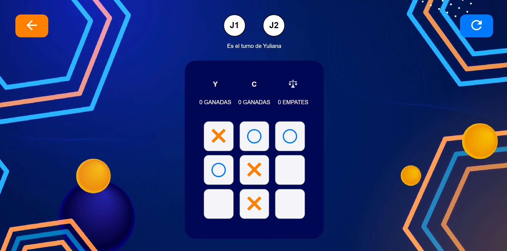
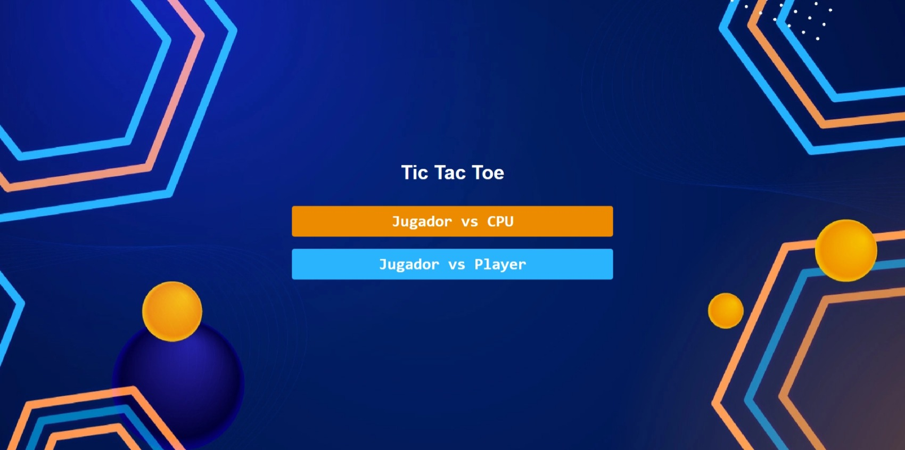
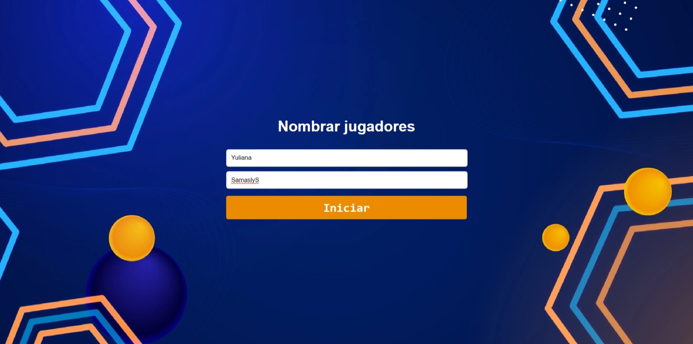

# Tic Tac Toe Game 🤓✅

Welcome to the Tic Tac Toe game! This project allows you to play Tic Tac Toe either by yourself or with someone else. You can personalize the game by entering your name and choosing your opponent. 


### Personal Play 🐧



### Play with Someone Else 👩🏻‍💻



## Getting Started 🔗

To run this project locally, follow these steps:

1. **Clone the repository:**

Bitbucket:
```bash
   git clone https://yzam0203@bitbucket.org/yulianazorrilla/ti-tac-toe-yz.git
   ```

Github:
   ```bash
   git clone https://github.com/Yuls0799/tictactoe.git
   ```

2.  **Run the project using Live Server:**
   - Install the Live Server extension in your code editor (e.g., Visual Studio Code).
   - Launch the server by right-clicking on `index.html` and selecting "Open with Live Server."

## Features 😎

- **Play Alone**: Challenge yourself against the computer.
- **Play with a Friend**: Invite a friend to join the fun.
- **Score Display**: Keep track of your wins and losses.

## Contribution

Feel free to contribute to this project by submitting a pull request or opening an issue.

## License

This project is licensed under the MIT License.

---
## Explanation in video 🧠
(https://youtu.be/hrH7s-SCSRY)

---

# Juego de Tres en Raya 🤓✅

¡Bienvenido al juego de Tres en Raya! Este proyecto te permite jugar al Tres en Raya solo o con otra persona. Puedes personalizar el juego ingresando tu nombre y eligiendo a tu oponente.


### Juego Personal 🐧


### Jugar con Alguien Más 👩🏻‍💻


## Primeros Pasos 🔗

Para ejecutar este proyecto localmente, sigue estos pasos:

1. **Clona el repositorio:**

Bitbucket:
```bash
   git clone https://yzam0203@bitbucket.org/yulianazorrilla/ti-tac-toe-yz.git
   ```

Github:
   ```bash
   git clone https://github.com/Yuls0799/tictactoe.git
   ```

2. **Ejecuta el proyecto usando Live Server:**
   - Instala la extensión Live Server en tu editor de código (por ejemplo, Visual Studio Code).
   - Inicia el servidor haciendo clic derecho en `index.html` y seleccionando "Open with Live Server".

## Características 😎

- **Jugar Solo**: Desafíate contra la computadora.
- **Jugar con un Amigo**: Invita a un amigo a unirse a la diversión.
- **Mostrar Puntuación**: Mantén un registro de tus victorias y derrotas.

## Contribución

Siéntete libre de contribuir a este proyecto enviando una solicitud de extracción o abriendo un issue.

## Licencia

Este proyecto está licenciado bajo la Licencia MIT.

---
## Explicación en video 🧠
(https://youtu.be/hrH7s-SCSRY)